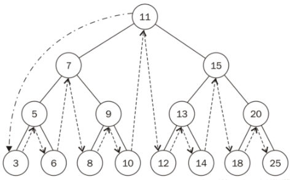

# 数据结构

> 所有的代码都可以直接粘贴到谷歌console中执行

## 二分法

当数据量很大适宜采用该方法。采用二分法查找时，数据需是排好序的。

基本思想：假设数据是按升序排序的，对于给定值key，从序列的中间位置k开始比较，

如果当前位置arr[k]值等于key，则查找成功；

若key小于当前位置值arr[k]，则在数列的前半段中查找,arr[low,mid-1]；

若key大于当前位置值arr[k]，则在数列的后半段中继续查找arr[mid+1,high]，

直到找到为止,时间复杂度:O(log(n))   。

### 代码实现

```js
/**
 * 二分法查找数组某个值的位置
 * @param {array} arr
 * @param {string | number} data
 * @returns
 */
function dichotomy(arr, data) {
  //执行次数
  let count = 0;
  let end = arr.length - 1;
  let start = 0;
  while (start <= end) {
    count++;
    let mid = Math.floor((end + start) / 2);
    if (arr[mid] < data) {
      start = mid + 1;
    } else if (arr[mid] > data) {
      end = mid - 1;
    } else {
      console.log('执行了' + count + '次');
      return mid;
    }
  }
  return -1;
}
var arr = [];
console.time();
for (let i = 0; i <= 100000000; i++) {
  arr[i] = i;
}
console.timeEnd();
console.time();
console.log(dichotomy(arr, 9), 'dichotomy');
console.timeEnd();
console.time();
console.log(arr.indexOf(9), 'indexOf');
console.timeEnd();
//比较了一下，js内置的indexOf，目标查找的索引越小的执行时间越快。
//但是随着数字越大，就变慢了很多，比二分法差
//所以在数据量大的时候还是建议使用二分法，如果数据比较少，indexOf更好（按照上面的测试，大于20万长度的数组就是二分法更胜一筹了）。
//但是前端的数据处理基本都不会超过10w数组，反正我没遇过，所以直接用indexOf没什么大问题，反而更佳，因为数组小。
```


## 链表（Linked List）

但是数组不总是最佳的数据结构，因为，在很多编程语言中，数组的长度都是固定的，如果数组已被数据填满，再要加入新的元素是非常困难的。而且，对于数组的删除和添加操作，通常需要将数组中的其他元素向前或者向后平移，这些操作也是十分繁琐的。

然而，JS中数组却不存在上述问题，主要是因为他们被实现了成了对象，但是与其他语言相比（比如C或Java），那么它的效率会低很多。

这时候，我们可以考虑使用链表(Linked-list) 来替代它，除了对数据的随机访问，链表几乎可以在任何可以使用一维数组的情况中。如果你正巧在使用C或者Java等高级语言，你会发现链表的表现要优于数组很多。

链表其实有许多的种类：单向链表、双向链表、单向循环链表和双向循环链表，接下来，我们基于对象来实现一个单向链表，因为它的使用最为广泛。

时间复杂度根据实现会有点不一样的。

### 单向链表

**链表中的节点仅指向下一个节点，并且最后一个节点指向空。**


其中，data中保存着数据，next保存着下一个链表的引用。上图中，我们说 data2 跟在 data1 后面，而不是说 data2 是链表中的第二个元素。上图，值得注意的是，我们将链表的尾元素指向了 null 节点，表示链接结束的位置。

由于链表的起始点的确定比较麻烦，因此很多链表的实现都会在链表的最前面添加一个特殊的节点，称为 **头节点**，表示链表的头部。

### 双向链表

他和`单向链表`的区别，在双向链表中，链接是双向的，一个链向下一个元素一个链向上一个元素。在操作双向链表的时候既要像普通链表一样考虑next，也要考虑prev。


### 循环链表

循环链表和单链表相似，节点类型都是一样，唯一的区别是，在创建循环链表的时候，让其头节点的 next 属性执行它本身


### 代码实现

```js
/**
 * 创建节点
 * @static
 * @param {string|number} element
 */
function LinkedListNode(element) {
  this.element = element;
  this.next = null;
  this.prev = null;
}

/**
 * 链表，元素必须是非对象类型（这个链表的元素是不可以重复的，目前是这样实现的）。
 * 双向链表空间复杂度比单向链表空间复杂度更复杂（理论两倍）
 * 单向链表时间复杂度比双向链表时间复杂度更复杂（理论最大倍数是n-2倍）
 * 单向或者双向链表
 * @class LinkedList
 */
class LinkedList {
  /**
   *Creates an instance of LinkedList.
   * @param {string} type 'one-way'|'bothway' 默认值bothway
   * @param {array} arrayData
   */
  constructor(type = 'bothway', arrayData) {
    if (type === 'one-way') {
      this.oneway = true;
    }
    if (type === 'bothway') {
      this.bothway = true;
    }
    //存放数据
    this.data = {};
    this.length = 0;
    this.head = new LinkedListNode('head');
    this.data['head'] = [this.head];
    this.lastElement = this.head;
    if (Array.isArray(arrayData)) {
      arrayData.forEach(v => {
        this.append(v);
      });
    }
  }
  /**
   * 追加元素
   */
  append(element) {
    const newNode = new LinkedListNode(element);
    const currentNode = this.lastElement;
    newNode.next = currentNode.next;
    currentNode.next = newNode;
    if (this.bothway) {
      newNode.prev = currentNode;
    }
    if (!newNode.next) {
      this.lastElement = newNode;
    }
    this.length++;
    if (this.data[element]) {
      this.data[element].push(newNode);
    } else {
      this.data[element] = [newNode];
    }
  }
  /**
   * 添加元素
   * @param {string | number} element
   * @returns {after,before}
   */
  insert(element) {
    const newNode = new LinkedListNode(element);
    const re = {
      after: afterElement => {
        const currentNode =
          this.data[afterElement] && this.data[afterElement][0];
        if (!currentNode) {
          console.warn('找不到节点插入');
          return;
        }
        newNode.next = currentNode.next;
        currentNode.next = newNode;
        if (this.bothway) {
          newNode.prev = currentNode;
        }
        if (!newNode.next) {
          this.lastElement = newNode;
        }
        this.length++;
        if (this.data[element]) {
          this.data[element].push(newNode);
        } else {
          this.data[element] = [newNode];
        }
      },
    };
    if (this.bothway && element !== 'head') {
      //只有head节点的时候，不可以向前插入。
      re.before = beforeElement => {
        const currentNode =
          this.data[beforeElement] && this.data[beforeElement][0];
        if (!currentNode) {
          console.warn('找不到节点插入');
          return;
        }
        newNode.prev = currentNode.prev;
        currentNode.prev.next = newNode;
        newNode.next = currentNode;
        currentNode.prev = newNode;
        this.length++;
        if (this.data[element]) {
          this.data[element].push(newNode);
        } else {
          this.data[element] = [newNode];
        }
      };
    }
    return re;
  }
  /**
   * 删除链表元素
   */
  remove(element) {
    const removeNode = this.data[element] && this.data[element][0];
    if (!removeNode) {
      console.warn('找不到节点删除');
      return;
    }
    const prevNode = this.findPrev(element);
    const nextNode = removeNode.next;
    prevNode.next = nextNode;
    if (nextNode) {
      //最后一个nextNode=null
      nextNode.prev = prevNode;
    }
    this.data[element].shift();
    if (this.data[element][0] === undefined) {
      delete this.data[element];
    }
    this.length--;
  }
  findPrev(element) {
    if (this.bothway) {
      //双向链表
      //这里的最大时间复杂度是O(1)
      if (this.data[element] && this.data[element][0]) {
        return this.data[element][0].prev;
      }
    } else {
      //单向链表
      //用不了二分法处理，因为是无序的，没法直接确定当前element处于哪个位置
      //这里的最大时间复杂度是O(n)
      let currentNode = this.head;
      while (currentNode.next && currentNode.next.element !== element) {
        currentNode = currentNode.next;
      }
      return currentNode;
    }
  }
  display() {
    var currentNode = this.head;
    while (currentNode.next) {
      console.log(currentNode.next.element);
      currentNode = currentNode.next;
    }
  }
  /**
   * 清空链表元素
   */
  clear() {
    //重置长度
    this.length = 0;
    //重置data
    this.data = {};
    this.head = new LinkedListNode('head');
    this.data['head'] = [this.head];
    this.lastElement = this.head;
  }
  /**
   * 根据索引获取元素，栈应该不怎么用到这个的
   */
  find(element) {
    return this.data[element][0];
  }
}

console.time('初始化数组');
let arr = [];
for (let i = 0; i <= 1000000; i++) {
  arr[i] = i;
}
console.timeEnd('初始化数组');

console.time('初始化链表');
var s = new LinkedList('bothway', arr);
console.timeEnd('初始化链表');

console.time('追加链表元素');
//添加
s.append('d');
console.timeEnd('追加链表元素');

console.time('追加数组元素');
//添加
arr.push('d');
console.timeEnd('追加数组元素');

console.time('删除链表元素');
//删除
s.remove('d');
console.timeEnd('删除链表元素');

console.time('删除数组元素');
//删除
arr.splice(arr.length - 1, 1);
console.timeEnd('删除数组元素');
//经过测试，js的数组在数据庞大的时候性能也挺好，而且数组还可以随机访问，优于链表
//c++、go这些编程语言数组定义需要内存空间，内存不会动态分配，链表某些场景更合适（js不存在这些问题。）
//所以js中能数组解决的，就没必要用链表了。
//这里另外测试出了一个性能问题，js闭包对执行效率影响很大，数据多的时候特别明显（函数retrun了一个函数，node节点刚开始的时候是这样处理的，后面改了）
//看下面的代码
/*
console.time('初始化数组-非闭包');
var arr = [];
function test2(element){
  this.a = element;
  return;
}
for (let i = 0; i <= 1000000; i++) {
  arr[i] = i;
  test2(1);
}
console.timeEnd('初始化数组-非闭包');
console.time('初始化数组-闭包');
var arr = [];
function test(element){
	function node(){
      this.a = element;
    }
    return new node();
}
for (let i = 0; i <= 1000000; i++) {
  arr[i] = i;
  test(1);
}
console.timeEnd('初始化数组-闭包');
*/
```

## 栈（Stack）

- 栈是元素的集合，其包含了两个基本操作：push 操作可以用于将元素压入栈，pop 操作可以将栈顶元素移除。另一个常用的操作是预览栈顶的元素(top)。 当然还有清空元素。

- 遵循后入先出（LIFO）原则，只能在顶端插入和移除。

  

- 时间复杂度

  - 索引: `O(n)`
  - 搜索: `O(n)`
  - 插入: `O(1)`
  - 移除: `O(1)`

### 代码实现

```js
class Stack {
  constructor(arrayData) {
    //存放数据
    this.data = {};
    //栈索引，从0算起
    this.index = 0;
  }
  /**
   * 栈长度
   * @readonly
   */
  get length() {
    return this.index;
  }
  /**
   * 尾部追加元素
   */
  push(element) {
    this.data[this.index] = element;
    this.index++;
  }
  /**
   * 出栈，会删除元素
   */
  pop() {
    this.index--;
    if (this.index < 0) {
      return;
    }
    const element = this.data[this.index];
    delete this.data[this.index];
    return element;
  }
  /**
   * 获取栈顶元素，不会删除元素
   */
  top() {
    return this.data[this.index - 1];
  }
  /**
   * 清空栈元素
   */
  clear() {
    //重置index
    this.index = 0;
    //重置data
    this.data = {};
  }
  /**
   * 根据索引获取元素，栈不怎么用到这个的
   */
  get(index) {
    return this.data[index];
  }
}
function print(str){
  console.log(str);
}
var s = new Stack();
s.push("David");
s.push("Raymond");
s.push("Bryan");
print("length: " + s.length);
print(s.top());
var popped = s.pop();
print("The popped element is: " + popped);
print(s.top());
s.push("Cynthia");
print(s.top());
s.clear();
print("length: " + s.length);
print(s.top());
s.push("Clayton");
print(s.top());
```

## 列队（Queue）

队列是限定只能在表的一端进行插入，在表的另一端进行删除的特殊的线性表。

- 队列是[先进先出](http://zh.wikipedia.org/wiki/%E5%85%88%E9%80%B2%E5%85%88%E5%87%BA)（FIFO, First-In-First-Out）的[线性表](http://zh.wikipedia.org/wiki/%E7%BA%BF%E6%80%A7%E8%A1%A8)。
- 队列只允许在后端（称为*rear*）进行插入操作，在前端（称为*front*）进行删除操作。
- **时间复杂度:**
  - 索引: `O(n)`
  - 搜索: `O(n)`
  - 插入: `O(1)`
  - 移除: `O(1)`

### 代码实现

```js
/**
 * js实现列队会相对简单点，如果在其他语言需要配合链表来处理会更好点。
 */
class Queue {
  constructor(arrayData = []) {
    //存放数据
    this.data = [];
    if (Array.isArray(arrayData)) {
      arrayData &&
        arrayData.forEach(v => {
          this.enqueue(v);
        });
    } else {
      console.warn('Queue实例化参数不是数组，不做处理！');
    }
  }
  //入队
  enqueue(element) {
    this.data.push(element);
  }
  //出队
  dequeue() {
    return this.data.shift();
  }
  //列队最前面的元素
  front() {
    return this.data[0];
  }
  //列队最后面的元素
  back() {
    return this.data[this.data.length - 1];
  }
  //列队展示
  toString() {
    var retStr = '';
    this.data.forEach(v => {
      retStr += v + '\n';
    });
    return retStr;
  }
  //是否是空队列
  isEmpty() {
    if (this.data.length === 0) {
      return true;
    } else {
      return false;
    }
  }
}

var q = new Queue();
q.enqueue('Meredith');
q.enqueue('Cynthia');
q.enqueue('Jennifer');
console.log(q.toString());
q.dequeue();
console.log(q.toString());
console.log('Front of queue: ' + q.front());
console.log('Back of queue: ' + q.back());
```

## 散列（Hash）

` 散列表`(Hash table，也叫哈希表)，是根据关键字(key value)而直接进行访问的数据结构。 说的具体点就是它通过吧key值`映射`到表中的一个位置来访问记录，从而加快查找的速度。

`散列表`是基于**快速存取**的角度设计的，也是一种典型的“**空间换时间**”的做法。顾名思义，该数据结构可以理解为一个线性表，但是其中的元素不是紧密排列的，而是可能存在空隙。

> 散列查找之所以能够通过计算来快速定位要找的关键词，一个基本的前提是在存放的时候也要通过同样的“计算方法”来定位存储的位置。

- 实现key值映射的函数就叫做散列函数
- 存放记录的数组就就叫做散列表

### 特性

- 确定性

  如果两个散列值是不相同的，那么这两个散列值的原始输入也是不相同的。

- 冲突（碰撞）

  散列函数的输入和输出不是唯一对应关系的，如果两个散列值相同，两个输入值很可能是相同的，但也可能不同。

- 不可逆性

  映射值是无法往回推出原key值的。

## 树（Tree）

树是无向、连通的无环图。

### 二叉树（Binary Tree）

- 二叉树即是每个节点最多包含左子节点与右子节点这两个节点的树形数据结构。

- **满二叉树**: 树中的每个节点仅包含 0 或 2 个节点。

- **完美二叉树**: 二叉树中的每个叶节点都拥有两个子节点，并且具有相同的高度。

- **完全二叉树**: 除最后一层外，每一层上的结点数均达到最大值；在最后一层上只缺少右边的若干结点。

  

#### 遍历方式

- 先序遍历

  访问根–>遍历左子树–>遍历右子树

  

- 中序遍历

  遍历左子树–>访问根–>遍历右子树

  

- 后序遍历

  遍历左子树–>遍历右子树–>访问根

  

- 广度遍历

  按照层次一层层遍历

### 二叉查找树（Binary Search Tree）

二叉查找树（BST）是一种特殊的二叉树，其任何节点中的值都会大于或者等于其左子树中存储的值并且小于或者等于其右子树中存储的值，因为这个的特性，它的查询效率高。

我们可以知道链表能快速删除插入，而二分法能快速查找。所以我们想找到一种结构既是链式结构，同时又能进行二分查找，同时保证查找和插入的高效性，二叉树相对来说插入、删除、查找都效率高（数据量大的时候）。

二叉查找树可以简单理解为单向链表和二分查找的结合（当然不是）。

- 时间复杂度
  - 索引: `O(log(n))`
  - 搜索: `O(log(n))`
  - 插入: `O(log(n))`
  - 移除: `O(log(n))`

### 红黑树

`二叉搜索树`的查找和搜索在平均情况下时间复杂度都能达到`O(logn)`，而且能保证数据有序。`二叉搜索树`的中序遍历就是数据的顺序。我们貌似已经找到了一个最理想的算法。

但是这个效率只是在平均情况下。如果数据是逆序，或者顺序，那么这棵树就会发生一边倒的情况使复杂度直接达到`O(n)`，就如同快排中选择到糟糕的主元(最大或者最小)。比快排糟糕的是，`快排`我们能通过随机打乱数据来避免这种情况发生。但`二叉搜索树`则不行，数据都是客户提供，直接插入到树中的，这种情况其实经常发生。

`红黑树`可以解决这个问题，红黑是一种[自平衡二叉查找树](https://zh.wikipedia.org/wiki/%E8%87%AA%E5%B9%B3%E8%A1%A1%E4%BA%8C%E5%8F%89%E6%9F%A5%E6%89%BE%E6%A0%91)。红黑树是每个节点都带有*颜色*属性的[二叉查找树](https://zh.wikipedia.org/wiki/%E4%BA%8C%E5%85%83%E6%90%9C%E5%B0%8B%E6%A8%B9)，颜色为*红色*或*黑色*。

`红黑树`最方便的地方除了插入和删除操作的代码略复杂以外，另外的操作都可以直接复制`二叉搜索树`。

`红黑树`是`2-3树`的变形，把`3-节点`分离开来使之成为普通的`2-节点`。但是怎么表现分离开的节点之间的联系呢。我们用红线把他们连起来。


巧妙地结合`二叉搜索树`的高效查找操作和`2-3树`的平衡插入操作。

每个节点都只有一根连向父节点的线。这个线的颜色称为节点的颜色。

## 参考

- [JS中的算法与数据结构——链表(Linked-list)](https://juejin.im/entry/59cb70995188256aa423b680)
- [二叉树与JavaScript](http://foreverz.cn/2016/10/19/%E4%BA%8C%E5%8F%89%E6%A0%91%E4%B8%8EJavaScript/)
- [查找算法之顺序、二分、二叉搜索树、红黑树 详细比较总结](http://threezj.com/2016/03/20/%E6%9F%A5%E6%89%BE%E7%AE%97%E6%B3%95%E4%B9%8B%E9%A1%BA%E5%BA%8F%E3%80%81%E4%BA%8C%E5%88%86%E3%80%81%E4%BA%8C%E5%8F%89%E6%90%9C%E7%B4%A2%E6%A0%91%E3%80%81%E7%BA%A2%E9%BB%91%E6%A0%91%20%E8%AF%A6%E7%BB%86%E6%AF%94%E8%BE%83%E6%80%BB%E7%BB%93/)
- [维基百科-红黑树](https://zh.wikipedia.org/wiki/%E7%BA%A2%E9%BB%91%E6%A0%91)